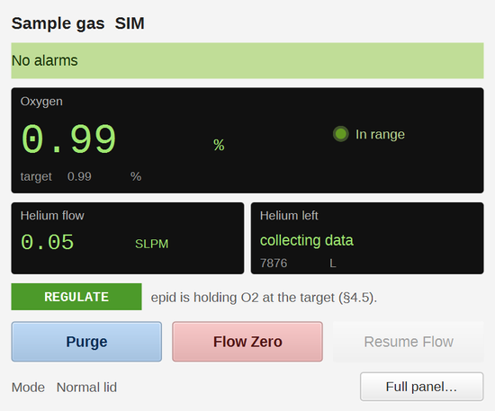
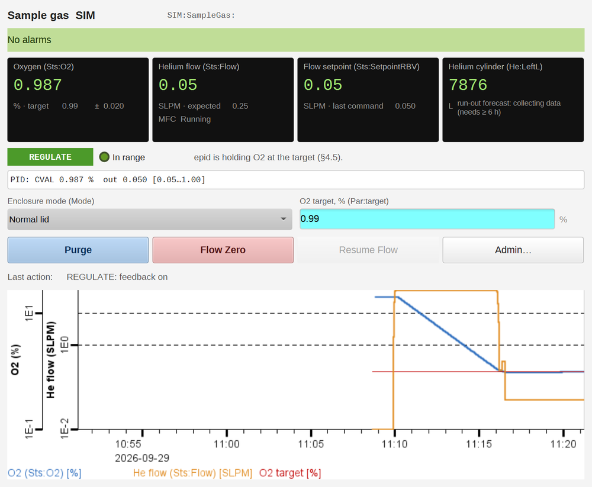
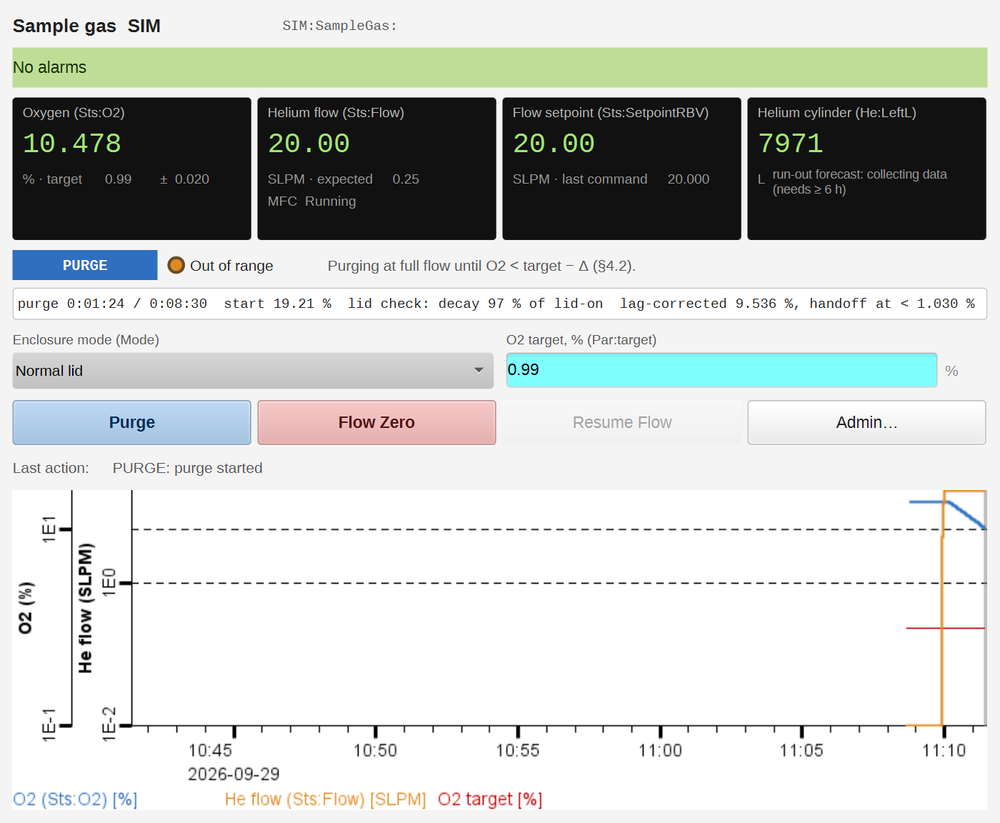
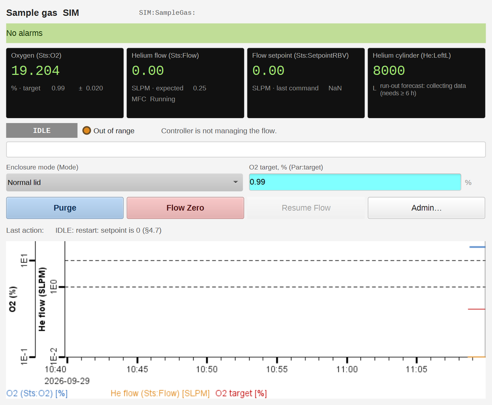
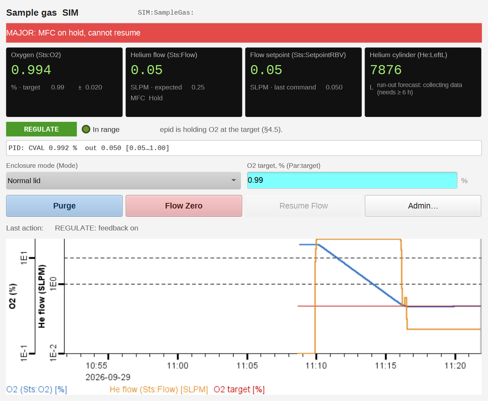
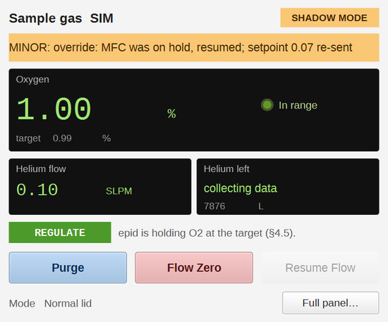
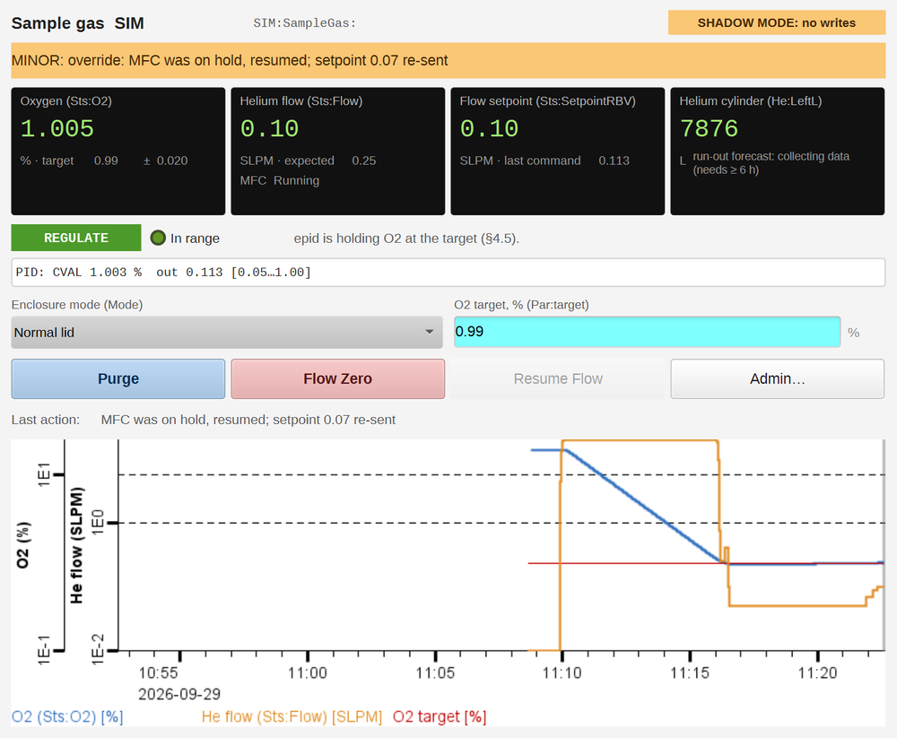
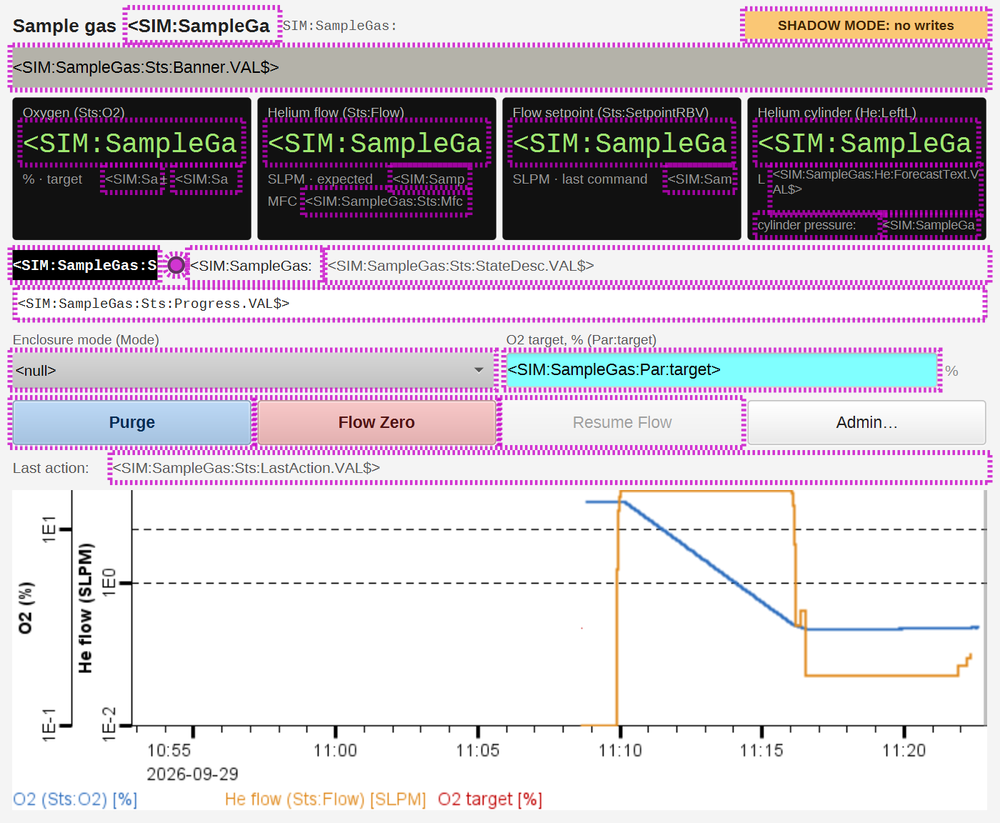
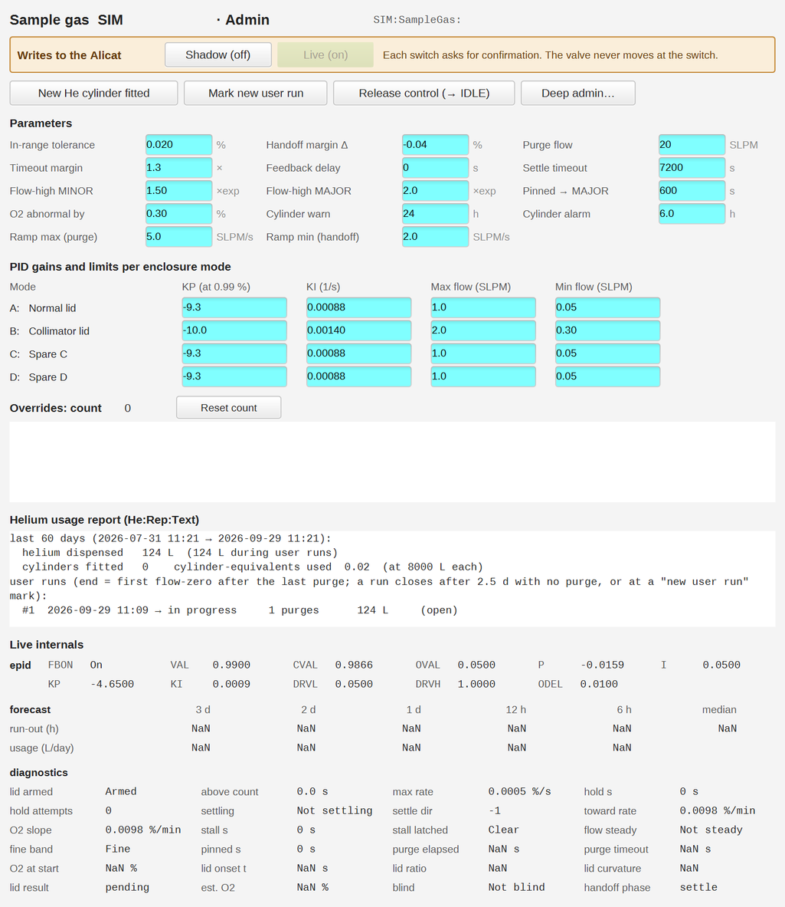
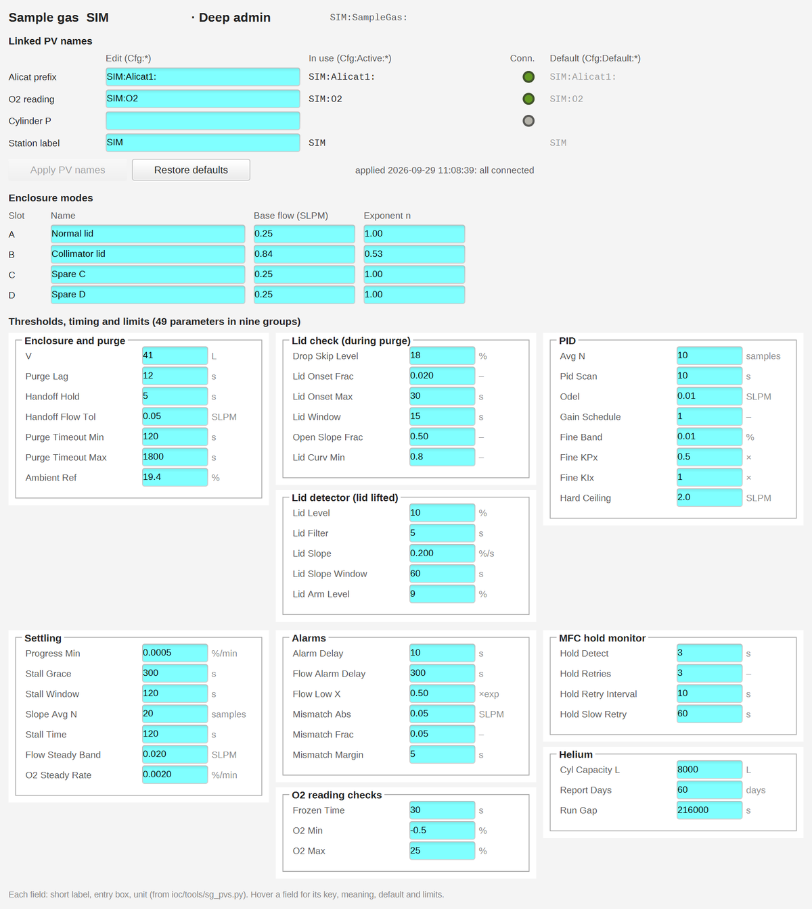

# Sample gas controller: operator guide

The `15LSS_sample_gas` IOC keeps the 15-ID-C sample enclosure under helium. You press **Purge**
after closing the lid. It floods the enclosure with helium until the oxygen is low, steps the flow
down, and then holds the O2 at the target (0.99 % by default) by adjusting the Alicat flow. It
stops the helium by itself if the lid is lifted, and it tracks the helium used and warns before
the cylinder runs out.

The screenshots come from the bench (simulated enclosure, prefix `SIM:SampleGas:`, station label
`SIM`). At the beamline the prefix is `15IDC:SampleGas:`; everything else looks the same.

- [1. Opening the screens](#1-opening-the-screens)
- [2. The simple panel](#2-the-simple-panel)
- [3. The full panel](#3-the-full-panel)
- [4. Everyday tasks](#4-everyday-tasks)
- [5. States](#5-states)
- [6. Alarms](#6-alarms)
- [7. Shadow mode and live mode](#7-shadow-mode-and-live-mode)
- [8. When the IOC is down](#8-when-the-ioc-is-down)
- [9. Admin](#9-admin)
- [10. Deep admin](#10-deep-admin)

## 1. Opening the screens

There are four displays, each opened with the one macro `P` (the controller prefix):

| Display | For | Opens from |
|---|---|---|
| `sampleGas_simple.bob` | everyday use: O2, flow, helium left, three buttons | — |
| `sampleGas_main.bob` | the full panel: setpoint, PID output, trend, target and mode | **Full panel…** on the simple panel |
| `sampleGas_admin.bob` | writes on/off, new cylinder, alarm thresholds, ramp clamps, gains | **Admin…** on the full panel |
| `sampleGas_deep.bob` | linked PV names, enclosure modes, every other parameter | **Deep admin…** on Admin |

At the beamline, open them with `P=15IDC:SampleGas:`.

## 2. The simple panel

From the top:
- **Banner:** green `No alarms`, or the active alarm texts, coloured by the worst one (yellow
  MINOR, red MAJOR).
- **Oxygen:** the O2 reading in %, with the target and a green LED when it is in range
  (target ± tolerance).
- **Helium flow:** what the Alicat measures, in SLPM.
- **Helium left:** days until the cylinder is empty at the recent rate, with the litres left
  beneath. It says "collecting data" for the first 6 hours after a new cylinder (and after a
  fresh install), until the forecast has enough use to go on.
- **State,** with a one-line description (section 5).
- **Buttons:** Purge, Flow Zero, Resume Flow (section 4), and **Full panel…**. The enclosure mode
  is shown here but can only be changed on the full panel.

## 3. The full panel

- **Banner and title:** the station label and the prefix.
- **Four readouts:**
  - **Oxygen,** with the target and tolerance.
  - **Helium flow,** with the flow expected for the selected enclosure mode, and whether the
    Alicat is running or on hold.
  - **Flow setpoint:** the Alicat's own setpoint, with the last value the controller commanded.
  - **Helium cylinder:** litres left, the run-out forecast, and the cylinder pressure when a
    gauge is linked (Deep admin, "Cylinder P"); without one the pressure line is hidden.
- **State line:** the state, the in-range LED and what the controller is doing. The PID line
  under it shows the averaged O2 the PID works on, its output, and its flow limits.
- **Enclosure mode:** pick the lid that is fitted (Normal lid, Collimator lid, …). The mode sets
  the expected flow and the PID gains, so a wrong mode shows up as a flow alarm.
- **O2 target:** type a new value and press Enter.
- **Buttons:** Purge, Flow Zero, Resume Flow, Admin….
- **Last action:** the last thing the controller did, or was told to do.
- **Trend:** O2 (blue) and helium flow (orange) on log axes, with the target (red), for the last
  30 minutes. The trend starts empty when the display is opened.

## 4. Everyday tasks

### Purge after closing the lid

Press **Purge**. The controller first checks the Alicat's settings (ramp rate, hold, gas table)
and corrects what it must (PRECHECK). Then it purges at full flow (PURGE):

Within the first minute of the purge it checks that the O2 falls the way it does with the lid
on. If it doesn't, the enclosure is probably open: it stops the flow (OPEN_STOP) instead of emptying the
cylinder. When the O2 is below the target, it steps the flow down to the expected flow (HANDOFF)
and turns the feedback on (REGULATE). The purge ends by itself; there is nothing more to press.

### Stop the helium

Press **Flow Zero**. The Alicat goes to 0 at once, whatever the controller was doing. It stays
at 0 until you press Purge or Resume Flow.

### Resume Flow

**Resume Flow** starts the feedback from the current flow, without a purge:
- after the O2 reading was lost and has come back (OPEN_LOOP);
- in IDLE, when the enclosure is already purged (O2 below 10 %), e.g. after writes were just
  turned on (section 7).

It is refused, with a note in the log, if the O2 reading is invalid, if the O2 is above 10 %
("purge first"), or if the Alicat is not connected. The button is greyed out except in
OPEN_LOOP and IDLE with a valid O2 reading (below 10 % in IDLE).

### Change the target or the enclosure mode

Both are on the full panel. A new target restarts the "settling" check (the controller expects
the O2 to move toward the new target and says so if it doesn't). A new mode takes effect at the
next PID step.

### New helium cylinder

On the Admin screen, press **New He cylinder fitted** and confirm. The litres left restart from a
full cylinder, and the forecast collects data again for 6 hours.

## 5. States

| State | What it means | Flow |
|---|---|---|
| IDLE | The controller is not managing the flow. After a fresh start, or when released on Admin. | whatever the Alicat has |
| PRECHECK | Checking and correcting the Alicat's settings before the purge. | unchanged (a second) |
| PURGE | Purging at full flow until the O2 is below the target by the handoff margin. | purge flow (20 SLPM) |
| HANDOFF | Stepping down to the expected flow, then turning the feedback on. | expected flow |
| REGULATE | The PID holds the O2 at the target. | PID output |
| OPEN_LOOP | The O2 reading is unavailable: fixed expected flow, no feedback. MAJOR alarm. | expected flow |
| FLOW_ZERO | Flow stopped by the operator. | 0 |
| OPEN_STOP | The enclosure was found open: the flow was stopped to save helium. MAJOR alarm. | 0 |

*IDLE after a fresh start: the controller does not touch the Alicat until you press a button.*

## 6. Alarms

The banner shows every active alarm; the colour is the worst one. The same alarms go to the
alarm server (`sampleGas_alarms.xml`).

*The Alicat stuck on hold: the controller wrote Run three times, then raised the alarm.*

| Alarm text | Level | What to do |
|---|---|---|
| `enclosure opened, flow stopped …` / `no O2 decay within … s of full flow: enclosure open?` / `purge decay … : enclosure open?` | MAJOR | Close the lid properly, then Purge. |
| `purge incomplete: timeout … reached before target − Δ` | MINOR (5 min) | The purge took too long; it went on to regulate anyway. Check the lid seal. |
| `O2 reading invalid` / `O2 reading frozen` | MAJOR | Check the O2 analyzer and its IOC. The controller runs at the expected flow meanwhile. |
| `O2 unavailable: running blind at fixed flow` | MAJOR | Same cause. When the O2 is back, press Resume Flow. |
| `MFC on hold, cannot resume` | MAJOR | The Alicat stays on hold although the controller wrote Run. Check it at the device or its IOC. |
| `flow mismatch: cylinder empty or MFC fault?` | MAJOR | The flow doesn't follow the setpoint: check the cylinder valve and pressure. |
| `MFC not responding …` | MAJOR | The Alicat's PVs are disconnected: check the Alicat IOC. |
| `flow ≥ … × expected: check enclosure (seal)` | MINOR / MAJOR | More helium than this lid needs: a leak, or the wrong enclosure mode. |
| `flow ≤ … × expected: wrong enclosure mode selected?` | MINOR | Much less helium than expected: check the mode. |
| `PID pinned at max flow: check enclosure seal` | MAJOR | The PID is at its flow limit and still can't reach the target. |
| `O2 above target range` / `O2 abnormally high` | MINOR / MAJOR | Regulating, but the O2 is high. |
| `target not reached within …` | MINOR | The O2 hasn't settled at the target in time. |
| `helium cylinder empty in < … h (forecast)` | MINOR (24 h) / MAJOR (6 h) | Change the cylinder soon; then press New He cylinder fitted. |
| `MFC gas table is …, not He (flow reading wrong)` | MINOR | Set the Alicat's gas table to helium. |
| `override: …` | MINOR (5 min) | Information: the controller corrected an Alicat setting (e.g. ramp rate, hold). The Admin screen keeps the list. |
| `waiting for the Alicat PVs …: controller not acting yet` | MAJOR | At IOC start: the Alicat IOC is not up. The controller acts as soon as it connects. |
| `controller not ticking (IOC up, program stalled)` (red over the banner; alarm server: `Sts:TickAge`) | MAJOR | The IOC answers but the controller has stopped: nothing on the panel is being updated, and the Alicat holds its last setpoint. Restart the IOC (`start_ioc 15LSS_sample_gas`, or `exit` and restart in its console). |
| `not configured: …` | MAJOR | A linked PV name is empty (Deep admin). |

## 7. Shadow mode and live mode

In **shadow mode** the controller runs every rule but writes nothing to the Alicat. What it would
have commanded shows as "last command" on the full panel. Both panels show a badge:

Switch on the Admin screen (**Shadow (off)** / **Live (on)**); each direction asks for
confirmation, and the valve never moves at the switch:
- **To shadow:** "Switch to shadow mode? The controller keeps running but stops writing; the
  Alicat stays at its current flow (… SLPM) until someone changes it."
- **To live:** "Enable writes? The Alicat (…) stays at its current flow (… SLPM). The controller
  goes to IDLE and changes nothing until you press Purge, Flow Zero or Resume Flow."

The production IOC starts live. Shadow mode is for commissioning and for comparing against
manual operation.

## 8. When the IOC is down

Every field shows its PV name in angle brackets with a magenta dashed border, the banner turns
grey, and the trend's lines go flat at their last values. The SHADOW MODE badge shows too: with
the IOC gone, nothing confirms that writes are enabled. The Alicat keeps its last setpoint, so the helium keeps flowing at that rate. The alarm server reports the
disconnection. The IOC does not restart by itself: start it with `start_ioc 15LSS_sample_gas`
on the IOC host. It resumes regulation where it was, without a bump in the flow.

## 9. Admin

- **Writes to the Alicat:** shadow / live (section 7).
- **New He cylinder fitted**, **Mark new user run** (starts a new entry in the usage report),
  **Release control (→ IDLE)** (the controller lets go; the Alicat keeps its flow).
- **Parameters:** tolerance, handoff margin, purge flow, purge timeout margin, feedback delay,
  settle timeout, flow-high thresholds, pinned time, O2-abnormal offset, cylinder warning and
  alarm times, and the two ramp-rate clamps: at purge start a faster Alicat ramp (or 0, instant) is
  lowered to **Ramp max (purge)**, 5 SLPM/s; at handoff a slower one is raised to
  **Ramp min (handoff)**, 2 SLPM/s. Hover a field for its meaning and limits.
- **PID gains and limits per enclosure mode:** KP (at 0.99 %), KI, maximum and minimum flow.
- **Overrides:** how often the controller corrected an Alicat setting, and the list.
- **Helium usage report** and the **live internals** (epid record, forecast windows,
  diagnostics) for troubleshooting.

## 10. Deep admin

- **Linked PV names:** the Alicat prefix, the O2 reading, the cylinder pressure and the station
  label. Edit, then **Apply PV names** (only in IDLE; confirmation). A new Alicat re-baselines the
  helium totalizer; press New He cylinder fitted if the cylinder is different too.
- **Enclosure modes:** name, base flow and exponent for each of the four slots.
- **Thresholds, timing and limits:** the other 49 parameters in nine groups. The defaults come from
  the enclosure measurements; change them only with a reason, and note it in the log book.
