# Sample-gas controller simulator: illustrated tour

This is a picture-by-picture companion to the text guide (`USER_GUIDE.md`, also under **? Help** in
the simulator). Every image is generated from the simulator itself by `tools/make_screenshots.py`,
so it can be refreshed after any change.

The URL in each caption reproduces the picture: open `simulator/sample_gas_simulator.html` followed
by that `#…` text. Screenshot mode uses a fixed random seed, so the numbers quoted below reappear
exactly.

## 1. The whole screen: regulating after a purge

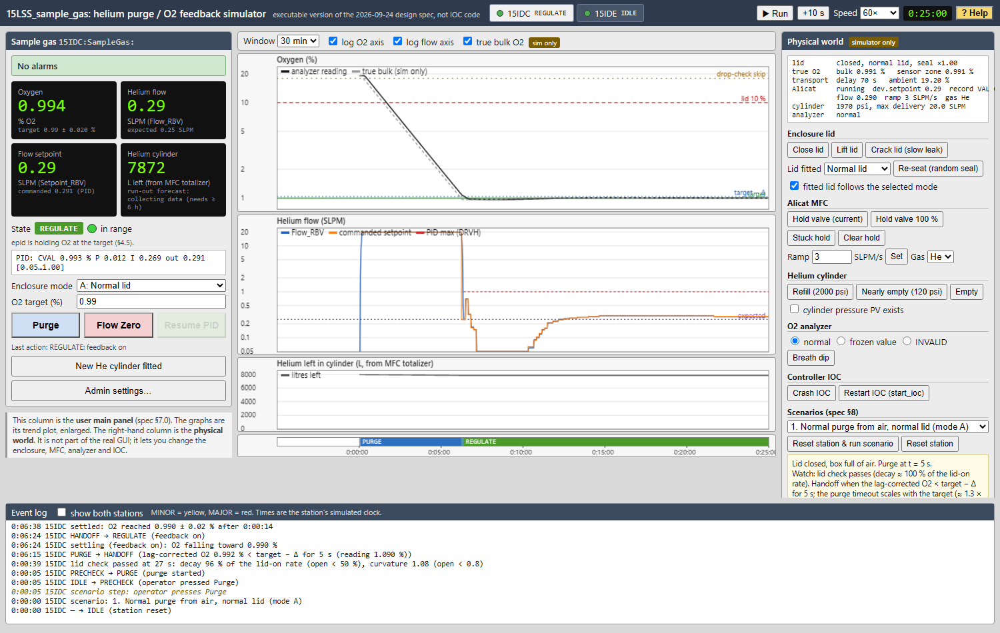

`#shot=1&t=1500&win=1800`: scenario 1, 25 min in.

- **Left column: the operator's main panel.**
  - green "No alarms" banner
  - the four readouts: O2 0.994 %, helium flow 0.29 SLPM, setpoint, helium left 7872 L
  - state **REGULATE** with the green in-range light
  - the PID line (CVAL, P, I, output and its limits)
  - mode, target and the buttons
- **Centre: the graphs.**
  - **O2 (log axis):** the purge from air down to 1 %. The black analyzer reading trails the grey
    true bulk O2. The green band is target ± tolerance.
  - **Flow:** the 20 SLPM purge, the step down at handoff, then the PID trimming around 0.25
    SLPM.
  - **Helium left**, and the **state strip** (PURGE in blue, REGULATE in green).
- **Right column: the physical world** (simulator only): lid, Alicat, cylinder, analyzer, IOC and
  scenarios.
- **Bottom: the event log**, newest first. Read it bottom-up:
  - the lid check passed at 27 s (decay 96 % of the lid-on rate, curvature 1.08)
  - handoff when the lag-corrected O2 reached target − Δ
  - feedback on
  - "settled" 14 s later

## 2. A purge in progress

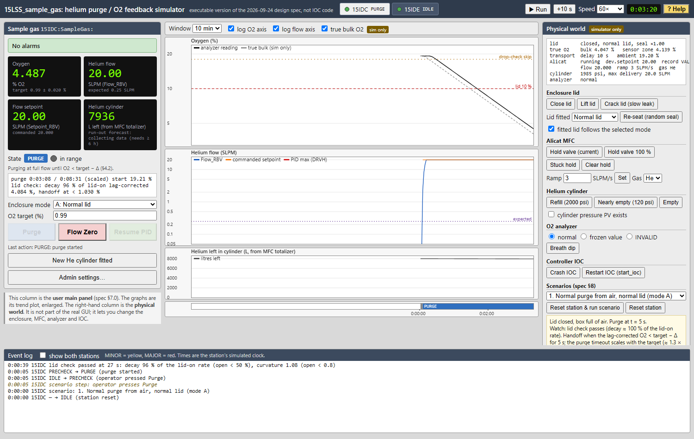

`#shot=1&t=200&win=600`

- **Flow** is at 20 SLPM, and O2 is falling exponentially on the log axis.
- **The progress line shows:**
  - elapsed time against the purge timeout, which scales with the target
  - the lid-check result (decay 96 % of the lid-on rate, so the lid is on)
  - the **lag-corrected** O2 the handoff uses (about 10 % below the reading at full flow)
  - the handoff level (target − Δ; Δ = −0.04 %, so 1.03 %)
- **Purge** is greyed out while purging. **Flow Zero** stays available.

## 3. Lid lifted without Flow Zero: helium stopped

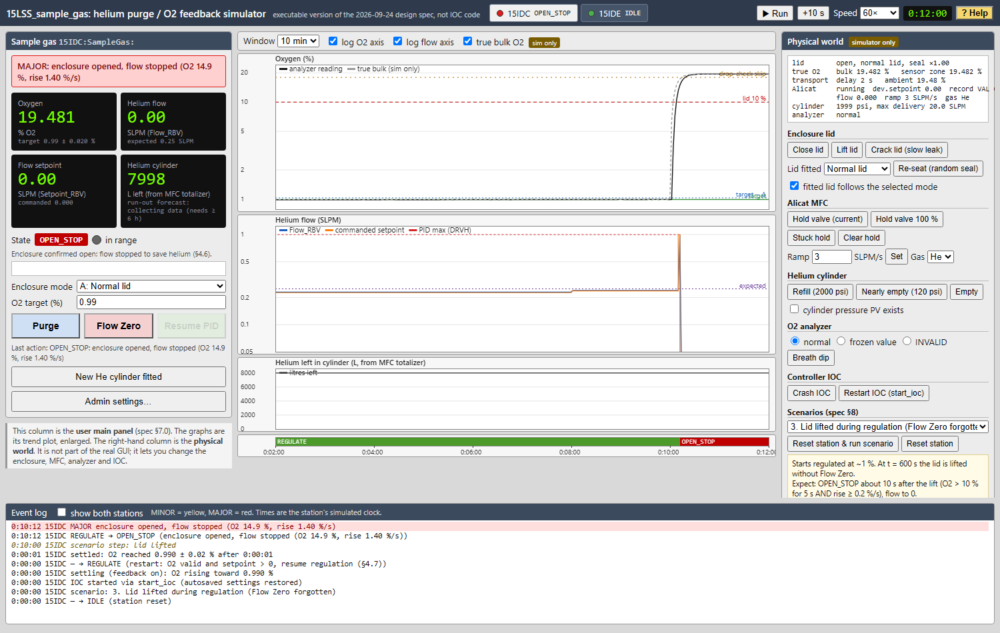

`#shot=3&t=720&win=600`: scenario 3, lid lifted at 10:00.

- **O2 jumps** from 1 % to ambient within seconds.
- **Twelve seconds after the lift,** the controller confirms "enclosure opened" (O2 > 10 % for 5 s
  **and** a fast rise) and drops the flow to **0**.
- **Red MAJOR banner, and state OPEN_STOP** (red in the state strip).
- **To recover:** close the lid, then press **Purge**.

## 4. Admin (beamline staff)

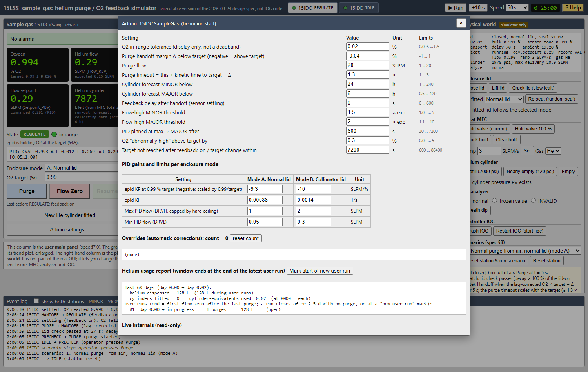

`#shot=1&t=1500&panel=admin`

- Tolerance, Δ, purge settings, feedback delay, alarm thresholds, settle timeout and cylinder
  alarm levels.
- The **PID gains and flow limits per lid**, with KP stated at 0.99 % and scaled automatically.
- **Hover over any field** for its meaning, unit and allowed range. Out-of-range entries are
  clamped and the field flashes.
- **Further down:** the override log, the helium usage report and the live internals.
- **Deep admin settings…** is at the bottom.

## 5. Deep admin (instrument scientist)

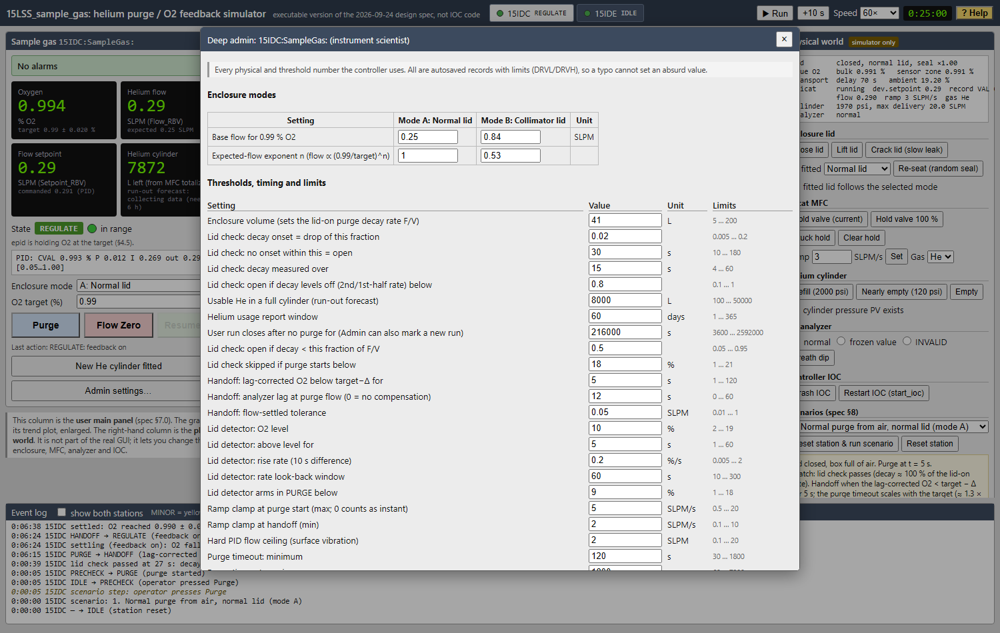

`#shot=1&t=1500&panel=deep`

- Every physical and threshold number the controller uses:
  - enclosure modes (base flow, expected-flow exponent)
  - lid check (onset, window, rate and curvature thresholds)
  - cylinder capacity, report window, user-run gap
  - handoff lag correction, lid detector, ramp clamps, flow ceiling, purge-timeout clamps
  - mismatch, hold monitor, O2 validity, averaging, epid scan and deadband
  - gain scheduling, the near-target fine band, and the settling and slope logic
- In the real IOC each of these is an autosaved record with limits.

## 6. Alicat on hold: resumed automatically

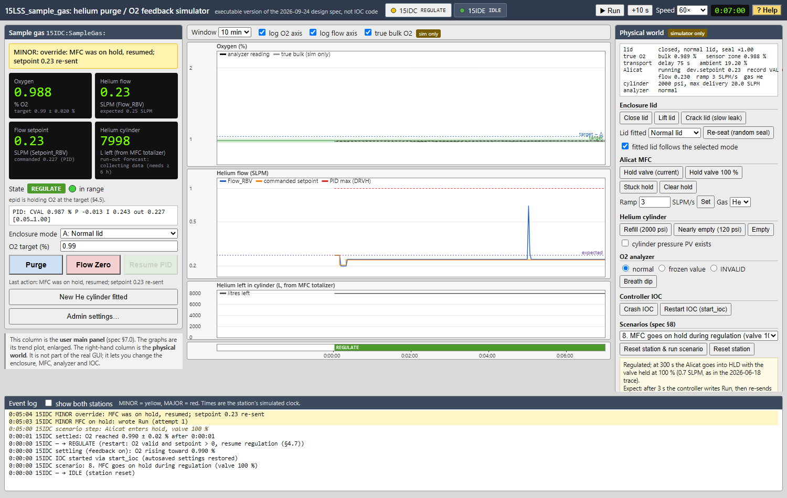

`#shot=8&t=420&win=600`: scenario 8.

- **At 5:00 the Alicat went into hold** with the valve at 100 % (the world button "Hold valve
  100 %", as seen in the June serial trace). The flow spikes.
- **Three seconds later** the controller wrote **Run** and re-sent its setpoint. The yellow MINOR
  banner says so, and the flow is back under PID control.
- **The scenario description** (bottom right) says what to watch for. **Reset station & run
  scenario** replays it.

## 7. Wrong lid for the selected mode

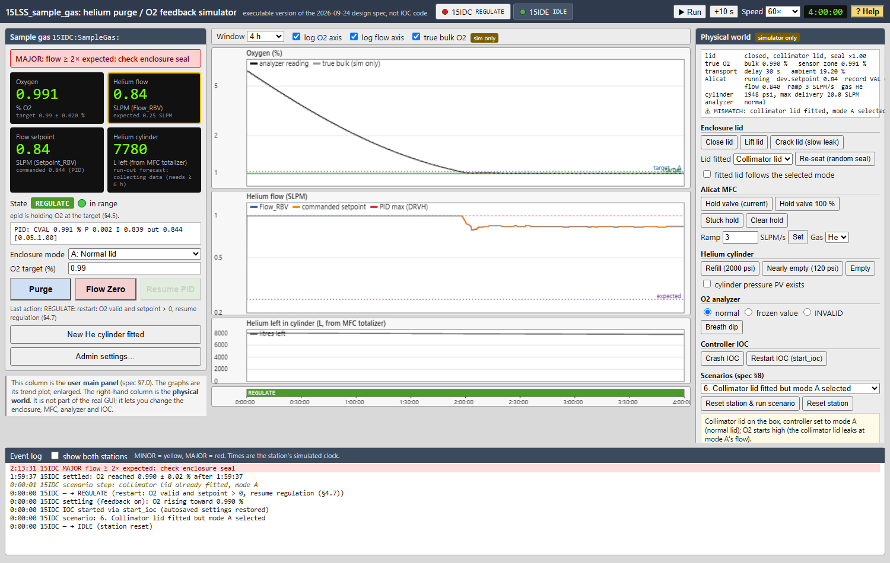

`#shot=6&t=14400&win=14400`: scenario 6.

- **The box has the collimator lid but mode A (normal lid) is selected.** The world panel shows
  "⚠ MISMATCH", and "fitted lid follows the selected mode" is unticked, because this mismatch is
  deliberate.
- **The PID needs ~0.83 SLPM** instead of mode A's expected 0.25. While O2 was still falling toward
  target (settling), no flow alarm fired.
- **After O2 settled (~2 h),** the MAJOR alarm "flow ≥ 2× expected: check enclosure seal" appeared.
  That is the right diagnosis: this enclosure needs far more helium than mode A assumes.

## 8. Changing the target: settling, no false alarms

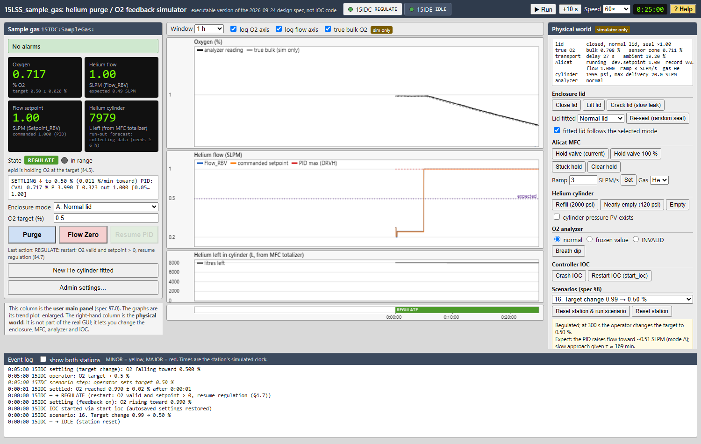

`#shot=16&t=1500&win=3600`: scenario 16, target changed from 0.99 % to 0.50 % at 5:00.

- **The progress line reads "SETTLING ↓ to 0.50 %"** and shows how fast O2 is approaching the new
  target.
- **The PID is at its 1.0 SLPM maximum,** but no alarm fires, because O2 keeps moving toward the
  target.
- **If O2 stalled,** or took more than 2 h, the flow and O2 alarms would apply at once.

## 9. Controller IOC down

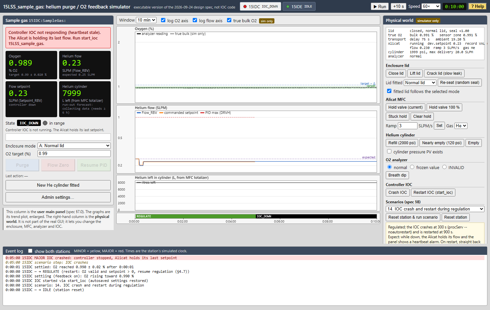

`#shot=14&t=600&win=600`: scenario 14, IOC crashed at 5:00.

- **Banner:** "Controller IOC not responding (heartbeat stale)". The state is **IOC_DOWN**, and the
  buttons are disabled.
- **The Alicat keeps its last setpoint,** so the enclosure stays purged.
- **In the scenario,** the IOC is restarted at 15:00 and resumes regulation without a bump.

## 10. Cylinder run-out forecast

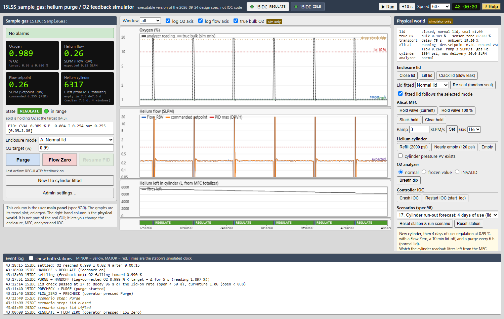

`#shot=17&t=172800&win=0`: scenario 17 after 2 days, whole history shown.

- **Six-hourly sample changes:** each Flow Zero / lid-off / purge cycle is a spike in O2 and flow.
- **Helium left** falls in steps at each purge.
- **The cylinder readout:** 6317 L left, "empty in 7.5–7.6 d (median 7.5 d, 4 windows)". The
  windows are the 3, 2, 1, 0.5 and 0.25-day usage fits that have enough data. Their spread is the
  confidence range, and early on it is wide.

## 11. Helium usage report

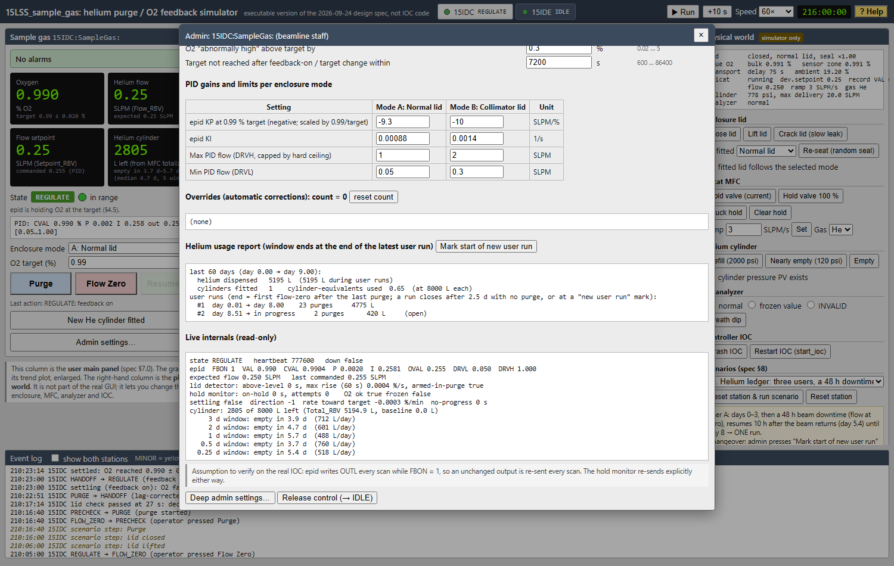

`#shot=19&t=777600&panel=admin&scroll=usage`: scenario 19 on day 9.

- **The report covers** the 60 days ending at the end of the latest user run: helium dispensed,
  litres during runs, cylinders fitted and cylinder-equivalents.
- **Run #1** is user A across a 48 h beam downtime: one run, 23 purges, 4775 L.
- **Run #2** is user B, still in progress (2 purges so far). "Cylinders fitted 1" is the cylinder
  fitted at the start; user B's cylinder change comes on day 9.5.
- **Mark start of new user run** splits runs at a changeover.
- **Live internals** (below) list each forecast window's usage rate and run-out time.

## 12. Plant model parameters (simulator only)

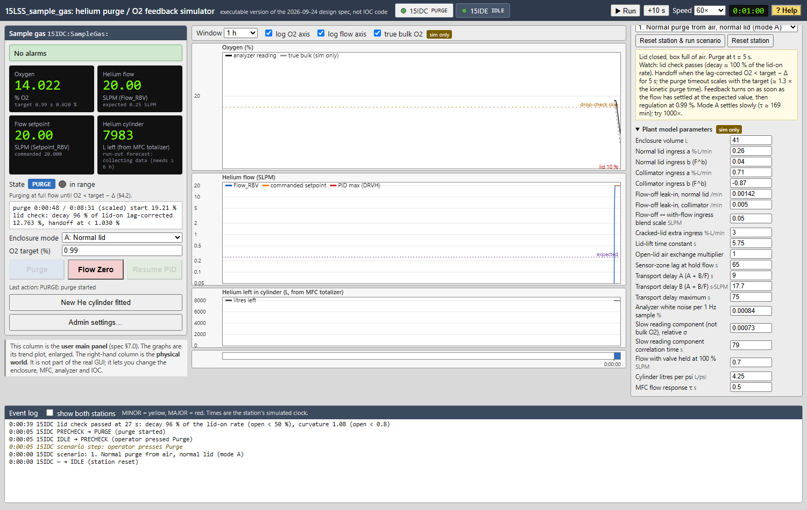

`#shot=1&t=60&details=1&scroll=plantGrid`

- The physics behind the simulation:
  - volume and leak laws per lid
  - flow-off leak-in, cracked-lid leak, lid-lift time constant, open-lid air exchange
  - sensor-zone lag and transport delay
  - analyzer noise and the slow reading component
  - Alicat response, and the cylinder
- **The controller never sees these.** Change them to test robustness, for example lower the
  open-lid air exchange to see where the lid check stops catching an open box.

## 13. Help

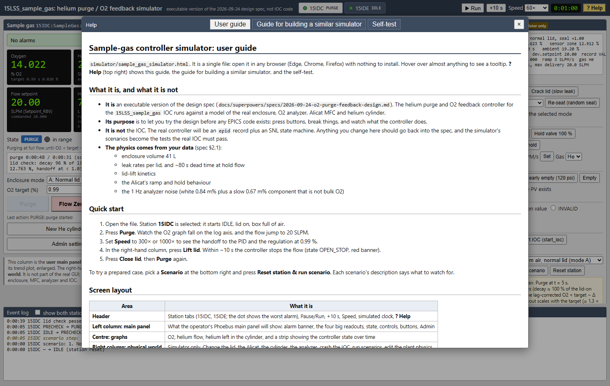

`#shot=1&t=60&panel=help`

- **User guide:** the text version of this tour, with full detail.
- **Guide for building a similar simulator:** for an AI agent writing one for another loop, e.g.
  temperature control.
- **Self-test.**

## 14. Self-test

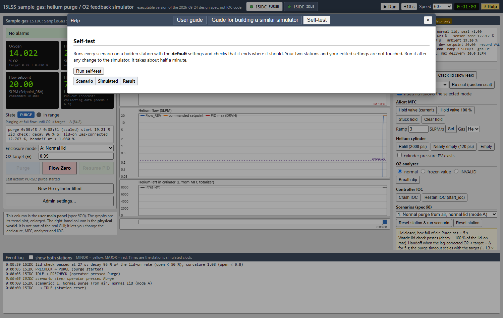

`#shot=1&t=60&panel=selftest`

- **Run self-test** runs every scenario on a hidden station with the **default** settings. It
  checks the end state and the key log messages, and takes about 10–30 s.
- **Your stations and settings are untouched.** A failing row states exactly what differed.
- Run it after any change to the simulator.
